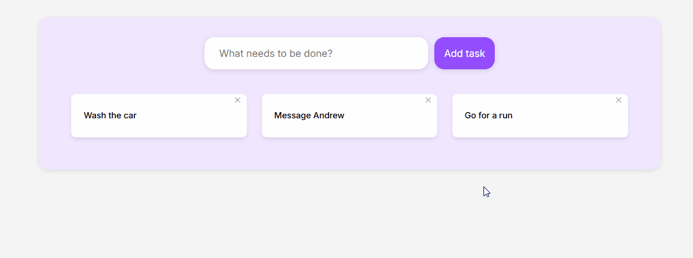

# Task Manager App

A full-stack task management application built with Spring Boot, vanilla JavaScript, HTML, and CSS.

Users can:
- create tasks
- delete tasks
- mark tasks as completed

The frontend communicates with a REST API using fetch and async/await.

## Demo

## Features

- Add tasks
- Delete tasks
- Toggle completed status
- Live UI updates without page refresh
- REST API integration
- Responsive card layout

## Tech Stack

Frontend:
- HTML
- CSS
- JavaScript

Backend:
- Java
- Spring Boot

Communication:
- REST API
- Fetch API

## Running Locally

### Backend

1. Navigate to backend folder
3. Run Spring Boot application

### Frontend

1. Open frontend folder in VSCode
2. Start Live Server
3. Open browser at:
http://127.0.0.1:5500

## API Endpoints

GET /tasks

POST /tasks

PUT /tasks/{id}

DELETE /tasks/{id}

## Planned Features

- Persist tasks in a database
- Edit existing tasks
- Add task categories
- Add due dates
- Filter completed/incomplete tasks
- Improve mobile responsiveness